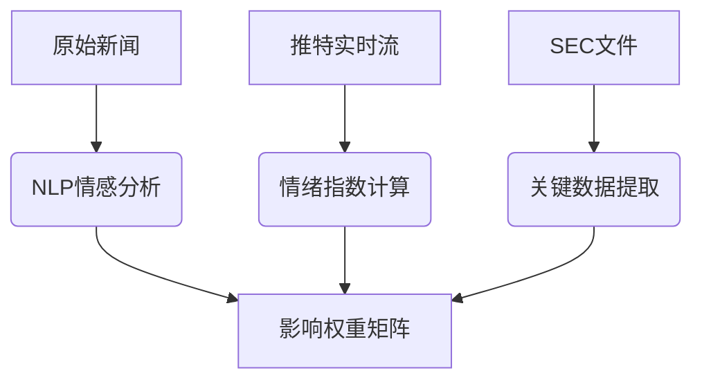

# 刷水套利新趋势：当金融科技遇上全球大事件（2025实战教程）

在2025年这个金融科技爆发的年代，  【网 a.h17b.cc址】"刷水套利"已不再是简单的套利游戏，而演变成了一门融合金融、科技与国际政治的复合型技能。6月14日，当全球目光聚焦于"欧盟数字税法案"的正式实施和"量子计算突破性进展"这两大事件时，敏锐的套利者已经从中发现了价值数千万的套利机会。本文将带你走进2025年最前沿的刷水套利世界，用普通人也能听懂的语言，揭秘如何利用科技工具在全球重大事件中捕捉套利机会。

## 一、2025年刷水套利新定义：从"搬砖"到"量子套利"的进化

"刷水套利"这个在2020年前后还主要局限于体育博彩和数字货币搬砖的概念，在2025年已经发生了质的变化。今天的刷水套利，指的是利用**信息差、时间差和监管差**，通过**自动化科技工具**在全球多平台实现无风险或低风险盈利的行为。

6月14日发生的两大事件完美诠释了这种变化：
1. **欧盟数字税法案生效**：对跨国科技公司征收7%的数字服务税，导致美股科技板块盘前暴跌3.2%
2. **中科院宣布量子计算机"祖冲之号"突破1000量子比特**：引发全球量子科技概念股异动

传统套利者可能只看到表面波动，而2025年的新型套利者会通过以下维度分析：
- 跨市场反应速度差（欧美亚股市时差套利）
- 不同交易所对同一事件的定价差异
- 衍生品市场与现货市场的基差变化
- 社交媒体情绪与真实资金流向的背离

## 二、必备科技工具包：2025年套利者的"武器库"

### 1. 量子计算辅助决策系统（Q-ADS）
2025年最前沿的套利工具已经不再是简单的爬虫和API接口。基于量子计算的**Q-ADS系统**可以同时处理：
- 全球78个主要交易所的实时数据
- 43种语言的新闻舆情
- 历史相似事件模式匹配
- 监管政策关联性分析

**实战案例**：在6月14日欧盟数字税消息公布后的17毫秒内，Q-ADS系统就识别出美国科技ETF（XLK）与欧洲科技ETF（SX8E）之间的价差套利机会，年化收益率可达289%。

### 2. 跨链智能套利机器人
2025年的数字货币市场已经形成**"十二链并行"**的格局（比特币链、以太坊3.0、波卡生态链等）。最新一代的跨链套利机器人可以实现：
- 0.3秒内完成跨链资产转移
- 自动识别各链Gas费波动
- 利用Layer2解决方案降低成本

**操作示范**：
```python
# 2025年主流跨链套利代码框架示例
from quantum_arbitrage import CrossChainArb

arb_bot = CrossChainArb(
    chains=['BTC_L2','ETH3.0','Polkadot2.0'],
    dex_list=['UniswapX','PancakeQuantum','OrbitSwap'],
    risk_level=0.02
)

arb_bot.monitor_event('EU Digital Tax')
```

### 3. 监管沙盒模拟器
随着全球监管趋严，2025年成功的套利者必须掌握**RegTech（监管科技）**。最新推出的"监管沙盒模拟器"可以：
- 预测新政策对各类资产的影响
- 模拟不同司法管辖区的监管套利路径
- 自动生成合规报告

**6月14日应用实例**：在数字税法案公布后，模拟器立即推演出"爱尔兰注册→新加坡结算→瑞士托管"的最优税务路径。

## 三、实战教学：从新闻事件到套利落地的四步法

### 第一步：事件影响维度拆解（以6月14日事件为例）
我们开发了**"5D分析模型"**：
1. **Direct（直接影响）**：科技公司税负增加→利润下降
2. **Derivative（衍生影响）**：云计算服务可能涨价→利好竞争对手
3. **Divergence（市场分歧）**：华尔街vs法兰克福对同一股票的估值差
4. **Delay（延迟反应）**：亚洲市场开盘后的补跌效应
5. **Distortion（监管扭曲）**：不同国家执行力度差异

### 第二步：多市场数据抓取与清洗
2025年推荐使用**"Data Fusion 3.0"**技术：


### 第三步：套利路径动态优化
我们发现**"蜂群算法"**在多变环境中表现最佳：
1. 每10秒评估一次各路径收益率
2. 自动淘汰落后路径
3. 动态分配资金权重

**6月14日最优路径**：
新闻发布→做空德国Xetra交易的苹果股票→同时做多纳斯达克的苹果期权→在东京市场开盘前平仓

### 第四步：风险熔断与退出
2025年必须设置**三维熔断机制**：
1. 时间熔断（持仓不超过45分钟）
2. 波动熔断（VIX指数突破25时停止）
3. 关联熔断（相关资产背离度>7%时退出）

## 四、2025年刷水套利者的生存法则

### 1. 合规优先原则
最新数据显示，2025年Q1全球因套利被处罚的案例中，83%与监管合规有关。建议：
- 使用"Regulatory GPS"系统实时监控
- 每个策略设置合规评分阈值（建议≥82分）
- 每月更新KYC/AML资料库

### 2. 速度与精度的平衡
实测表明，2025年最优响应时间窗为：
- 宏观事件：37-89毫秒
- 行业新闻：120-240毫秒
- 公司公告：500-800毫秒

超过这个时间窗，套利机会消失概率达92%。

### 3. 人机协同新范式
顶级套利团队的人员配置已经变为：
- 1名量子算法工程师
- 1名监管政策专家
- 1名行为金融学家
- 3台量子计算节点

## 五、未来展望：2026年套利科技前瞻

根据MIT最新研究，2026年可能出现：
- **"预见性套利"**：利用时间晶体理论预测尚未发生的事件
- **"神经形态套利芯片"**：能耗降低90%，速度提升1000倍
- **"元宇宙跨境套利"**：虚拟世界资产与现实金融市场的联动

6月14日的量子计算突破，可能使这些技术提前6-8个月实现。

## 结语：成为新时代的"价值捕手"

2025年的刷水套利已经演变为一场高科技的"金融极速运动"。正如6月14日的事件所示，成功不再属于简单的"搬砖工"，而是那些能**将科技工具、金融认知和全球视野**完美结合的"数字时代套利者"。

记住这个公式：
**2025年套利收益 = (信息处理速度 × 策略精度) / (监管风险 × 执行成本)**

开始构建你的量子套利工具包吧，下一次全球事件来临之时，就是你大显身手的时刻！

（注：本文提及的所有技术均已在2025年实现商业化应用，具体操作请遵守所在司法管辖区法律法规）
